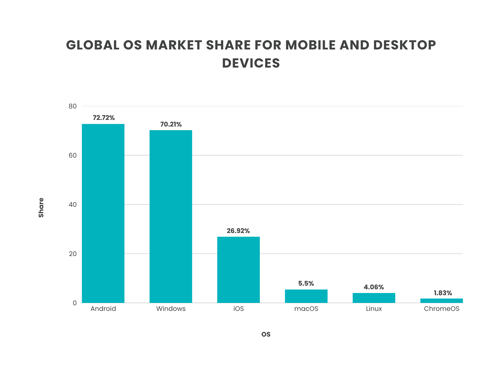
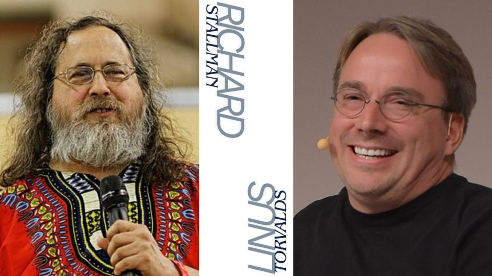
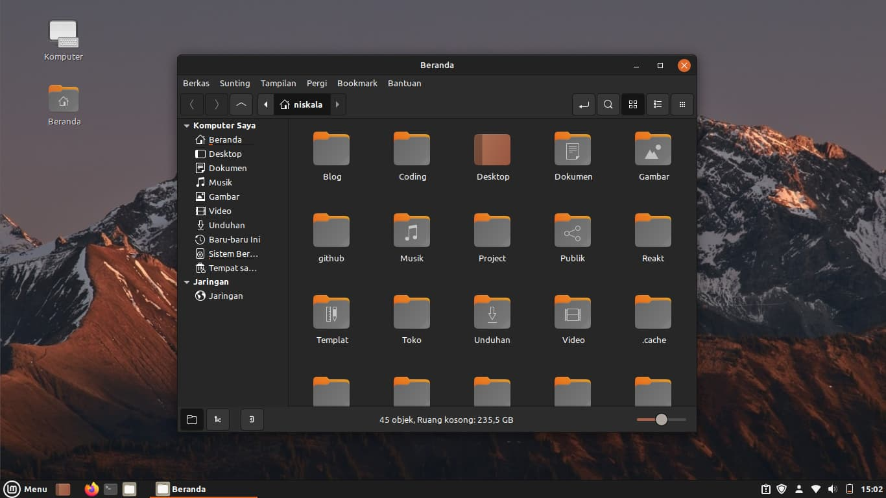

Como um fã de *Star Trek*, lembro especialmente de uma cena inusitada no filme **Jornada nas Estrelas IV: A Volta para Casa**, onde o personagem do engenheiro-chefe Scotty tem que interagir com um computador do século XX e acaba por inicialmente chamar o computador por voz (assim como os computadores da nave *USS Enterprise*), e falhando em ter uma resposta.

O "Hello, computer" dito como algo de outro mundo (literalmente) pelo personagem é uma realidade hoje, e isso evidencia como a forma de usar um computador avançou nas últimas décadas.

Apesar de dos avanços técnicos, a função de um computador em si não mudou consideravelmente. Um computador pessoal (PC) em sua essência edita textos, converte arquivos, cria tabelas e navega na internet; alguns vão fazer isso de forma mais otimizada, outros irão fazer com uma interface bonita, mas as operações vão continuar tendo a mesma natureza.

# Como definimos um computador

Na percepção comum, um computador é um aparelho com interface visual que é utilizado com *mouse*, *teclado* e uma *tela*. Essa é a interação mais básica com a máquina, mas o ponto principal de um computador é a função que dá seu próprio nome, computar.

Qualquer máquina ou aparelho que faça essa função, é um computador. Ábacos, calculadoras eletrônicas, réguas de cálculo (esse merece ser pesquisado na internet), até mesmo pessoas que desempenham cálculos específicos podem ser designadas como "computadores". Para computadores modernos, pode-se separar suas partes em **software** e **hardware**.

> Hardware é toda estrutura que compõe a parte física de um computador, suas partes e peças. Enquanto o software é designado como todo sistema interno do computador, não físico, onde todas as operações serão orquestradas e processadas.

## Por que trabalhar em um computador?

Apesar de tecnicamente serem computadores, celulares, tablets e outros *smart devices* não entram no escopo de um PC. Ao pensar em um computador pessoal, associa-se a imagem de alguém realizando uma tarefa séria, ou no mínimo complexa o suficiente para necessitar de um. Obviamente pode-se escrever uma monografia em um celular ou editar uma planilha em um tablet, mas isso não parece certo. 

Seja por uma maior eficiência ou um condicionamento prévio, é necessário utilizar um computador pessoal para realizar tarefas mais laborosas. E dado o contexto atual, pode-se tentar fazer duas previsões:

- Se você está lendo isso de um celular ou tablet, *provavelmente* você está utilizando um dispositivo **Android**;

- Se você está em um notebook ou desktop, *provavelmente* você está utilizando um computador com **Windows**;

Não sei se de fato eu acertei, mas essas previsões surgem a partir da distribuição de *sistemas operacionais (OS)* que já são integrados com tais dispositivos, seguindo uma tendência de mercado. Não que necessariamente esses sistemas sejam melhores ou mais fáceis de usar, mas sim que as empresas que os desenvolveram possuem uma dominância grande no mercado e inserem seus sistemas operacionais em uma gama de dispositivos.

> Um **Sistema Operacional** (OS) é o software fundamental que gerencia todo o hardware e os recursos de um computador, servindo como intermediário entre a máquina e o seu usuário (ou entre a máquina e outros programas). Ele controla coisas como o processador, a memória, o armazenamento, os dispositivos de entrada e saída, e a execução de todos os outros softwares instalados.

Uma consequência direta da predominância dessas sistemas no mercado é a dependência em seu uso. Cada OS possui o próprio ecossistema de programas e aplicações, que são em geral incompatíveis com outros sistemas operacionais.

## Sistemas e seus jardins fechados

O conceito de **Walled Garden** (*Jardim Fechado*, em tradução livre) é definido como um ecossistema fechado por design — onde o fornecedor restringe deliberadamente a interoperabilidade com fora do seu sistema (a *App Store* da **Apple** é o exemplo mais citado disso).

A incompatibilidade proposital entre recursos de um sistema e a falta de portabilidade dos dados do usuário são formas de desestimular a mudança dos consumidores para outras marcas ou sistemas operacionais. Mercadologicamente, é uma estratégia válida afinal uma empresa não quer perder sua base de clientes e consumidores; impedir ou desestimular que eles mudem para a concorrência é o natural. Produtos físicos são limitados em um estoque e para cada novo produto criado há um gasto, que precisa ser compensado pela sua venda.

Entretanto em um ambiente digital essa lógica não necessariamente é uma verdade. O custo para criação de um software é primordialmente originado em sua criação/manutenção — sua replicação e distribuição não gera custos, é somente a cópia de um arquivo digital que já foi criado.

Logo, mercadologicamente é necessário criar barreiras no próprio design do produto para que ele tenha uma escassez artificial, aumentando seu valor de mercado.  

# O real ganho da dependência

Qual o sentido de restringir suas aplicações a um ambiente fechado? O natural seria disponibilizar a máxima compatibilidade para que usuários possam utilizar esses softwares (pagos ou gratuitos) em mais dispositivos. Pelo menos esse é o raciocínio pensado no desenvolvimento de um produto.

Entretanto em empresas atuais de tecnologia o objeto central do desenvolvimento não é a criação de um produto com um final em si mesmo, ou seja, algo que resolva um problema existente. A criação de um software/produto é a consequência do objetivo principal, que é criar uma base de consumidores que forneçam dados que possam alimentar o modelo de negócio da empresa. 

É estimado que a *Google* tenha **1.8 bilhões** de usuários ativos globalmente @kiran2024gmail e a empresa *Meta* tenha **2.9 bilhões** de usuários no *Facebook* e **2 bilhões** no *Instagram* @statista_socialmedia. Os produtos que essas empresas desenvolveram tem uma qualidade inegável e um valor de mercado muito alto, porém eles não se comparam em proporção ao valor de mercado que as informações coletadas por essas empresas podem gerar.

Além do monopólio nos serviços, empresas como essas buscam o monopólio dos **usuários**. Se todas as suas informações pessoais estão em um celular com Android, isso significa que a *Google* possui informações suas que não estão disponíveis para a *Apple* — logo se uma população inteira possui a dependência/costume de usar um ecossistema em suas tarefas diárias, a base de dados e informações da empresa que monopoliza esse ecossistema é infinitamente mais rica que a dos seus concorrentes.

Transpondo isso em valores:

- *Google* sozinho gerou **US$ 264,59 bilhões** em receita publicitária em 2024, o que representa cerca de 25% de todo o mercado global de anúncios @statista2024googleadrev;

- A receita publicitária da *Meta* foi de **US$ 160,6 bilhões** no ano inteiro de 2024, representando cerca de 15% do mercado global @mediaincanada2025meta;

Nossos dados não são interessantes/valiosos em nível pessoal, empresas não querem saber meandros do cotidiano de cada um. Somos simplesmente alvos de interesse de mercado e marketing, o principal ponto da coleta de informações é traçar o perfil consumidor dos usuários e determinar em qual grupo eles se encaixam. A partir da coleta de hábitos e preferências de consumo, pode-se enviar propagandas e anúncios personalizados que possuem uma efetividade de venda muito maior, afinal sabe-se do que a pessoa em questão tem interesse.

> O perfilamento dos usuários pode ser realizado de várias maneiras. Em redes sociais é medido por histórico de engajamento — curtidas, comentários, compartilhamentos, etc. Além dos padrões de consumo, é possível discernir coisas como posicionamento político e relações sociais/familiares. Em mecanismos de busca, como o *Google*, isso é feito de forma mais direta através do histórico de busca. 

Existem diversas técnicas de *redução de dimensionalidade* e *machine/deep learning* que podem fazer esse tipo de perfilamento, planejo falar sobre elas em um próximo post. 

## Como dados são coletados

Agora que sabemos o real valor dos dados que os usuários concedem para as *big techs*, é possível entender algumas coisas que observamos no cotidiano:

- Tente relembrar quantos sites ou aplicativos já pediram a criação de uma conta somente para usar um de seus serviços;

- Ao ligar um computador *Windows* pela primeira vez, é pedido para você logar em uma conta *Microsoft*;

- Praticamente todos os websites coletam *Cookies*;

- Aplicativos em seu celular já solicitaram sua permissão para acesso de dados (como a sua galeria) e uso de recursos (câmera, microfone, etc);

Todas essas informações possuem um alto valor de mercado e são essenciais para a coleta de dados — some isso aos termos e contratos que aceitamos sem ler onde se concede todo tipo de informação de forma voluntária, e tem-se a receita perfeita para uma coleta de dados volumosa dos usuários. 

# Possuir ou Alugar?

Essa introdução sobre o porquê dos dados serem tão importantes e como as empresas estão ultrapassando todos os limites legais e morais para obtê-los é diretamente ligada à um problema que nos assola constantemente: somos realmente donos do *hardware* que adquirimos?

Digo isso com um exemplo bem claro em mente — computadores com CPUs fabricadas antes de 2018 não suportam mais o sistema operacional *Windows 11*. Com a versão **24H2**, a *Microsoft* atualizou a lista de processadores *Intel* compatíveis, exigindo agora a 11ª geração e mais recentes. Anteriormente, o *Windows 11* suportava processadores da 8ª geração em diante. Ou seja, quem tinha um Core i7 de 2018-2020 (8ª a 10ª geração) pode ter ficado sem suporte para a versão mais recente [@microsoft2024win11specs; @pcworld2025win1124h2cpu].

Além do processador, os requisitos exigem **TPM 2.0**, Secure Boot e UEFI — sem negociação. Muitos PCs de 2016/2017 têm o chip TPM mas com ele desabilitado por padrão na BIOS, o que às vezes é resolvido apenas ativando nas configurações @microsoft2024win11sysreq.

Além desses requerimentos, a *Microsoft* encerrou oficialmente o suporte ao *Windows 10* em outubro de 2025 @rimo3_2026win11cpu. As pessoas que possuem computadores mais antigos com esse sistema não estão mais sujeitas as atualizações de segurança oficiais; o que pode trazer sérios riscos à usabilidade e aos dados do usuário.

Esse tipo de postura força com que os usuários abandonem suas máquinas "antigas", que na maioria das vezes estão perfeitamente funcionais, para adquirir um novo hardware somente para ter as atualizações da empresa. Para usuários comuns isso até pode passar batido com uma certa vista grossa, porém em ambientes corporativos a  demanda por atualizações de segurança é constante — o que força a renovação das máquinas para ter suporte ao novo sistema.

> Em **termos muito gerais**: **CPU** é o processador, o cérebro do computador. **TPM** é um chip de segurança que guarda chaves criptográficas. **Secure Boot** impede que software não autorizado rode na inicialização. **UEFI** é o firmware moderno que substitui o BIOS e liga o hardware ao sistema operacional.

## A fragilidade do software

O exemplo da Microsoft é o mais evidente e próximo do nosso cotidiano, por isso o escolhi para abordar o assunto. A verdade é que o mesmo ocorre em diversos âmbitos da vida moderna, no *late stage capitalism* a palavra possuir está sendo sobrescrita pela expressão "alugar" ou "assinar". 

Pode-se citar outros exemplos de indústrias automobilísticas, como a **BMW** que em 2022 lançou um programa chamado "*Functions on Demand*", que passou a cobrar uma assinatura mensal dos proprietários dos carros para ter acesso ao hardware que já era instalado de fábrica. O caso que gerou mais revolta foi a função de aquecimento dos bancos que já existia no carro, porém só era liberada mediante ao pagamento do serviço (mesmo após a compra do carro) @techradar2026bmwsubscription. Obviamente a decisão não foi bem vista pelo público e a empresa "decidiu" voltar atrás @forbes2023bmwdrops.

Outro exemplo rápido de automóvel com bloqueios de software surge da marca de veículos elétricos **Tesla**, onde a capacidade de *Full-Self Driving* (FSD - Um piloto auromático do carro) é "desbloqueada" a partir da assinatura mensal de US$ 99, apesar do veículo já ter toda a capacidade e hardware presentes no automóvel [@tesla2024fsdsubscription; @cbtnews2026teslafsd].

Casos onde um *hardware* é bloqueado de forma total ou parcial de cumprir as funções que já possui estão se tornando uma tendência de mercado, e mesmo após a compra do produto é necessário realizar algum serviço de assinatura para poder utilizá-lo de forma total. E juntamente com a tendência de coisas *smarts* (geladeira smart, máquinas de lavar smart, micro-ondas, etc) temos cada vez mais a dependência de *softwares* desnecessários e proprietários sem nenhuma garantia de manutenção futura ou bugs que impeçam equipamentos básicos de funcionar.

# Nosso amigo pinguim

Na tentativa de escapar da concessão involuntária de dados e da obsolescência mediada por software, muitas pessoas (não muitas ainda 😭) migram para sistemas *open source* que dependem de comunidades para sua manutenção.

Um software **open source** é aquele que possui seu código fonte disponibilizado publicamente,  permitindo que qualquer pessoa leia, modifique, distribua e use o programa livremente @redhat2024oss. O que difere radicalmente de um *software* proprietário (como no caso de softwares de empresas) que são fechados e seu código é mantido em segredo; o open source é construído de forma transparente — qualquer pessoa pode ver exatamente como ele funciona por dentro.

Na prática, isso significa que desenvolvedores do mundo inteiro podem contribuir com melhorias, corrigir falhas de segurança ou adaptar o software para suas próprias necessidades, sem precisar pedir permissão ao autor original.

## Open source e Linux

Antes de falar de Linux em si (depois de todo esse rodeio), eu gostaria de mencionar duas figuras importantes para essa história: **Richard Stallman** e **Linus Torvalds**. Em 1983 *Stallman* lança o **Projeto GNU**, inspirado no UNIX (sistema operacional pago da época), o programador decidiu criar um OS livre e gratuito, criando para isso a *Free Software Foundation*. Apesar de criar diversos componentes de um sistema operacional, faltava uma peça central em seu sistema: O *kernel*.

Em 1991, *Torvalds* anunciou, em um fórum da internet, que estava desenvolvendo um kernel por hobby. Esse kernel foi chamado de **Linux**. O kernel é a camada mais profunda do sistema operacional, ele quem faz a ponte entre o hardware e os programas, gerenciando os dispositivos para que funcionem de forma segura.

Ele o disponibilizou publicamente e, ao adotar uma licença livre, permitiu que programadores do mundo inteiro contribuíssem com melhorias. A combinação do kernel Linux com as ferramentas do projeto GNU resultaram no sistema que hoje chamamos de GNU/Linux — um sistema operacional completo, gratuito e de 
código aberto.

> Stallman, ao criar a Free Software Foundation inicia o movimento que hoje chamamos de open source. Todos os códigos open source necessitam de uma licença para operar, é ela quem vai delimitar as diretrizes de modificação, reprodução e uso comercial do código. As licenças MIT e GPL são ótimos 
exemplos e ainda continuam sendo adotadas até hoje (eu inclusive tenho um projeto com a licença GPL).

O linux se espalhou velozmente na comunidade de desenvolvedores da época e hoje está presente em quase todos os servidores que hospedam algum serviço na web. Existem versões desktop também que são menos conhecidas e adotadas por menos usuários.

Como o sistema é um conjunto de utilidades + kernel, tudo com código aberto, o OS sofreu diversas modifições. Cada subsistema baseado no código original é chamado de **distribuição**. Distribuições são mantidas por suas respectivas comunidades e derivadas do código original público do sistema operacional — porém com muito mais recursos para o uso cotidiano (interface gráfica, gestão de sistema, aplicativos nativos, etc). Digamos que usar o kernel linux diretamente é pouco prático.

## Mais sobre "distros"

Distribuições ou "distros" são essas variações do kernel que estão livremente disponibilizadas de forma pública e gratuita (a maioria delas). Ao falar sobre esse tópico, podemos abordar as principais fundações (distribuições):

| Distro | Particularidades |
|:-------|:-----------------|
| **Debian** | Estabilidade máxima. Base de centenas de derivadas. |
| **Ubuntu** | Popularizou o Linux no desktop. Suporte LTS de 5 anos. |
| **Fedora** | Vitrine de tecnologias da Red Hat. Sempre atualizada. |
| **Arch Linux** | Rolling release. Filosofia KISS. Wiki referência. |
| **Linux Mint** | Desktop intuitivo. Ideal para quem vem do Windows. |

Para iniciantes, eu pessoalmente recomendo utilizar a distro **Linux Mint**, o ambiente de desktop lembra a interface gráfica do *Windows*; além de ser um sistema estável e confiável. É possível ver mais sobre no site oficial da distribuição: [https://linuxmint.com/](https://linuxmint.com/).

Para usuários avançados, distros *rolling release* (que recebem atualizações mais cedo) podem ser mais vantajosas, entretanto elas devem ser usadas com cautela, a cada nova atualização que surge são necessários testes e feedbacks da comunidade para a detecção de bugs e defeitos. Para isso o *Arch Linux* e seus derivados podem ser utilizados, entretanto é preciso cautela (os avisos repetitivos refletem problemas que já me ocorreram 😭). 

# Por que usar Linux

Não estou pedindo para que pessoas abandonem seus computadores *Windows* e mudem radicalmente para um sistema que não conhecem. O Windows é um excelente OS que possui suporte para diversos softwares fundamentais em uma vasta gama de áreas (muitos que só são suportados pelo sistema exclusivamente), além de já ser consolidado entre a maioria dos usuários — algo que as pessoas de fato sabem utilizar.

Entretanto tenho uma atenção especial para estudantes, acadêmicos e desenvolvedores de software *open source*. Usar Linux pode ser uma questão de livre acesso e disponibilidade de informações — além da possibilidade de reprodutibilidade (que é essencial na ciência e no desenvolvimento de novos softwares), bases fundamentais de qualquer pesquisa científica.

Outro fator, como foi tocado anteriormente, é a obsolescência programada instaurada pelas fabricantes. Sistemas Linux tem suporte contínuo da comunidade e são "leves" para computadores atuais e antigos (bem antigos mesmo), onde o usuário pode desfrutar de recursos modernos mesmo que em *hardwares* mais velhos – um computador pode continuar mantendo sua função, independente da idade. Só pensarmos que itens como carros e eletrodomésticos já fazem isso, por que não os eletrônicos? Por que não podemos cobrar uma vida útil longa para computadores e celulares?  

## Como o linux pode beneficiar a academia?

Em outras palavras, a escolha de usar um software livre e aberto, além de ser filosófica pode ser considerada estratégica. Tornar o fazer da pesquisa baseado em *open source* pode ajudar na sua reprodução e distribuição.

O primeiro ganho pode ser econômico, utilizar linux poupa recursos com o pagamento de licenças de software proprietário, além de possuir ferramentas nativas como R, Python, LaTeX, Git e compiladores que são essenciais para a pesquisa e análise de dados; passo fundamental na análise estatística de qualquer trabalho.

Estamos falando de um ambiente altamente mantido pela comunidade, então sua reprodutibilidade é garantida para todos os usuários. A partir do momento que a nova versão de algum software é atualizada para um sistema linux, todos os seus usuários tem a escolha de atualizar ou não. Caso uma versão seja muito antiga, ela ainda pode rodar no sistema sem problemas. Isso pode não ocorrer em sistemas Windows, por exemplo. Versões de softwares muito novas podem não rodar em hardwares com versões antigas do Windows (como XP e Vista).

Vamos fazer uma lista de valores: 

- O **Windows 11 Pro** custa R$ 1.599 na Microsoft Store Brasil — esse é o preço oficial por licença. Em um laboratório com 30 máquinas, são quase R$ 48 mil só em sistema operacional;

- No Brasil, o **Microsoft 365** Personal passou de R$ 36 para R$ 51 por mês, enquanto o Family subiu de R$ 45 para R$ 60 mensais. No plano anual, assinantes estão descobrindo que pagarão R$ 509 (Personal) ou R$ 599 (Family) por ano, em vez dos R$ 359 e R$ 449 que pagavam antes — um aumento de até 42%. Para uso institucional/comercial, os valores são ainda maiores por usuário;

- Após a redução de preços no Brasil, **Photoshop**, **Illustrator** e **Premiere Pro** custam R$ 65 por mês cada, e o Lightroom caiu para R$ 34 mensais.

- O **IBM SPSS Statistics** tem assinatura base a partir de US$ 105/mês (cerca de R$ 600/mês na cotação atual), podendo chegar a US$ 3.830 na licença perpétua (aproximadamente R$ 22 mil). A IBM não publica preços específicos em reais, e os valores variam conforme o revendedor, mas o custo é reconhecidamente proibitivo para pesquisadores individuais. No Linux, R e Python fazem o mesmo trabalho de graça;

Para um único pesquisador no Brasil: Windows (R$ 1.599) + Microsoft 365 (R$ 509/ano) + Adobe CC app individual (R$ 780/ano) + SPSS (~R$ 7.200/ano na assinatura base) = algo em torno de **R$ 10 mil** no primeiro ano. Para um departamento de 30 pessoas, o custo de licenças pode ultrapassar **R$ 200 mil** anuais. Com Linux e ferramentas livres, esse valor cai para praticamente zero; 

## Softwares alternativos gratuitos

Claro que vão existir empecilhos e dificuldades ao se substituir *softwares* pagos. O usuário que deixar esses serviços terá uma grande curva de aprendizado para percorrer, e nem sempre os mesmos recursos e *features* presentes nos serviços pagos estão disponíveis de formas simples gratuitamente. 

Todavia eu particularmente entendo que apesar das dificuldades postas, a recompensa em não se depender mais desses serviços e a conhecimento agragado na jornada de aprendizado são importantes para uma formação profissional.

Irei mencionar aqui alguns softwares gratuitos e disponíveis que podem servir de alternativa para serviços pagos:

| Categoria | Software Pago | Alternativa Gratuita no Linux |
|:----------|:--------------|:------------------------------|
| Sistema operacional | Windows (~R$ 1.599) | Ubuntu, Fedora, Linux Mint |
| Pacote de escritório | Microsoft Office (~R$ 509/ano) | LibreOffice, OnlyOffice |
| Escrita acadêmica | Microsoft Word | LaTeX, Quarto, Typst |
| Planilhas | Microsoft Excel | LibreOffice Calc, Gnumeric |
| Apresentações | Microsoft PowerPoint | LibreOffice Impress, Quarto Revealjs |
| Análise estatística | IBM SPSS (~R$ 7.200/ano) | R, JASP, PSPP |
| Análise estatística avançada | SAS, Stata | R, Python (statsmodels, scipy) |
| Edição de imagens | Adobe Photoshop (~R$ 780/ano) | GIMP, Krita |
| Ilustração vetorial | Adobe Illustrator (~R$ 780/ano) | Inkscape |
| Edição de vídeo | Adobe Premiere Pro (~R$ 780/ano) | Kdenlive, DaVinci Resolve, Shotcut |
| Diagramação | Adobe InDesign | Scribus, Quarto |
| Leitura e edição de PDF | Adobe Acrobat Pro | Okular, Evince, LibreOffice Draw |
| Gerenciador de referências | EndNote (~R$ 1.500) | Zotero, JabRef |
| Análise qualitativa | NVivo, ATLAS.ti | RQDA, Taguette |
| Matemática simbólica | MATLAB (~R$ 5.000+) | GNU Octave, SciPy, Maxima |
| Modelagem 3D | AutoCAD, SolidWorks | FreeCAD, Blender, OpenSCAD |
| SIG / Geoprocessamento | ArcGIS (~R$ 8.000+/ano) | QGIS, GRASS GIS |
| Edição de áudio | Adobe Audition | Audacity, Ardour |
| Notas e organização | Microsoft OneNote, Notion | Obsidian, Joplin, Logseq |
| Comunicação acadêmica | Microsoft Teams, Zoom (pago) | Jitsi Meet, Element (Matrix) |

# Motivação pessoal

Apesar dos pontos objetivos, meu motivador pessoal para a adoção de sistemas Linux no meu cotidiano foi a sensação de descobrir toda a capacidade de um computador. Se pararmos para pensar no avanço da técnica, as máquinas que portamos estão em escalas e níveis de grandeza maiores quando se trata sobre capacidade de processamento que aparelhos de 20-30 anos atrás: um avanço tão estratosférico dificilmente ocorreu com outras tecnologias em tão pouco tempo ao longo da história humana.  

Usar Linux nos permite entender um pouco dessa capacidade e criar um novo encanto para uma coisa que passa praticamente despercebida na nossa rotina. Não paramos para pensar na complexidade das redes ao enviar um e-mail; em como um arquivo de imagem é salvo no computador (sério, pare pra pensar como deve ser passar instruções para uma máquina salvar uma IMAGEM digitalmente. Como isso deve ocorrer?); A imensa quantidade de informações que circula na internet todos os dias; e várias outras operações invisíveis que só funcionam, independente do nosso olhar desatento para esses detalhes.

Voltar ao sentimento de curiosidade genuína e descoberta é algo indescritível e eu espero que alguns de vocês, leitores, possam experenciar isso ao ter contato e aprender sobre linux.
